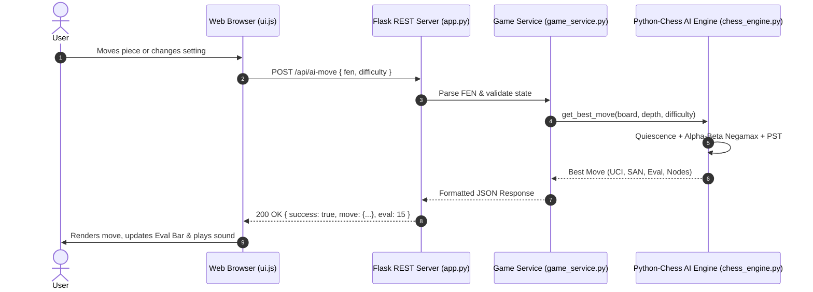

# Grandmaster Chess — REST API Reference

The Grandmaster Chess backend is powered by a Python microservice built on **Flask** and the standard **`python-chess`** library. It exposes a high-performance REST API on port `5173` that handles chess game validation, legal move computation, FEN/PGN serialization, and artificial intelligence tree search.

---

## 🌐 Overview & Base URL

```http
http://127.0.0.1:5173/api
```

- **Protocol**: HTTP/1.1
- **Content-Type**: `application/json`
- **CORS Support**: Enabled (`*`) on all endpoints.
- **Threading**: Multi-threaded request processing enabled for non-blocking concurrent AI calculations.

---

## 🏗️ Architecture & Request Pipeline



---

## 📑 Endpoints Summary

| Method | Endpoint | Description | Auth |
| :--- | :--- | :--- | :---: |
| `GET` | [`/api/health`](#1-get-apihealth) | Server health check and engine metadata | None |
| `POST` | [`/api/ai-move`](#2-post-apiaimove) | Computes the optimal AI move for a position | None |
| `POST` | [`/api/legal-moves`](#3-post-apilegalmoves) | Returns all legal destination squares for a piece or position | None |
| `POST` | [`/api/validate-move`](#4-post-apivalidatemove) | Validates and applies a move to a FEN position | None |
| `POST` | [`/api/game-status`](#5-post-apigamestatus) | Evaluates checkmate, stalemate, and draw conditions | None |
| `POST` | [`/api/export-pgn`](#6-post-apiexportpgn) | Generates standard Portable Game Notation (PGN) text | None |

---

## 1. GET `/api/health`

Checks server liveness, operational status, and active engine configuration.

### Request
```http
GET /api/health HTTP/1.1
Host: 127.0.0.1:5173
```

### Response (`200 OK`)
```json
{
  "status": "healthy",
  "engine": "Python-Chess AI",
  "mode": "hybrid",
  "version": "1.0.0"
}
```

### Example Usage
```bash
curl -X GET http://127.0.0.1:5173/api/health
```

---

## 2. POST `/api/ai-move`

Calculates the best move for the active player in a given FEN position using Negamax with Alpha-Beta pruning, Piece-Square Tables, and Quiescence search.

### Request Body
| Field | Type | Required | Default | Description |
| :--- | :--- | :---: | :---: | :--- |
| `fen` | `string` | **Yes** | — | Valid FEN string representing current position. |
| `difficulty` | `string` | No | `"medium"` | AI difficulty tier: `"easy"`, `"medium"`, or `"hard"`. |

```json
{
  "fen": "rnbqkbnr/pppppppp/8/8/4P3/8/PPPP1PPP/RNBQKBNR b KQkq e3 0 1",
  "difficulty": "medium"
}
```

### Response (`200 OK`)
```json
{
  "success": true,
  "move": {
    "uci": "g8f6",
    "from": "g8",
    "to": "f6",
    "promotion": null,
    "san": "Nf6"
  },
  "eval": 15,
  "nodes": 48,
  "fen": "rnbqkb1r/pppppppp/5n2/8/4P3/8/PPPP1PPP/RNBQKBNR w KQkq - 1 2",
  "turn": "w",
  "status": {
    "is_game_over": false,
    "is_check": false,
    "is_checkmate": false,
    "is_stalemate": false,
    "is_insufficient": false,
    "can_threefold": false,
    "can_fifty": false,
    "title": "In Progress",
    "description": "White to move.",
    "winner": null,
    "reason": null
  }
}
```

### Response Fields
- `eval`: Position evaluation in centipawns from the perspective of the side to move (positive favors mover, negative favors opponent).
- `nodes`: Total search tree nodes evaluated.
- `san`: Human-readable Standard Algebraic Notation move string (e.g. `Nf6`, `exd5`, `O-O`, `Qxf7#`).

### Example Usage
```bash
curl -X POST http://127.0.0.1:5173/api/ai-move \
  -H "Content-Type: application/json" \
  -d '{"fen": "rnbqkbnr/pppppppp/8/8/4P3/8/PPPP1PPP/RNBQKBNR b KQkq e3 0 1", "difficulty": "hard"}'
```

---

## 3. POST `/api/legal-moves`

Retrieves all legal moves for either an entire board or filtered by a specific starting square.

### Request Body
| Field | Type | Required | Default | Description |
| :--- | :--- | :---: | :---: | :--- |
| `fen` | `string` | **Yes** | — | Valid FEN string. |
| `square` | `string` | No | `null` | Optional algebraic square (e.g. `"e2"`). If omitted, returns all legal moves. |

```json
{
  "fen": "rnbqkbnr/pppppppp/8/8/8/8/PPPPPPPP/RNBQKBNR w KQkq - 0 1",
  "square": "e2"
}
```

### Response (`200 OK`)
```json
{
  "success": true,
  "count": 2,
  "moves": [
    {
      "uci": "e2e3",
      "from": "e2",
      "to": "e3",
      "san": "e3",
      "promotion": null,
      "is_capture": false
    },
    {
      "uci": "e2e4",
      "from": "e2",
      "to": "e4",
      "san": "e4",
      "promotion": null,
      "is_capture": false
    }
  ]
}
```

---

## 4. POST `/api/validate-move`

Validates whether an attempted move is strictly legal under FIDE rules, applies the move if valid, and returns the updated FEN state.

### Request Body
| Field | Type | Required | Description |
| :--- | :--- | :---: | :--- |
| `fen` | `string` | **Yes** | Starting position in FEN. |
| `move` | `string` | **Yes** | Move in UCI format (e.g. `"e2e4"`, `"e7e8q"`). |

```json
{
  "fen": "rnbqkbnr/pppppppp/8/8/8/8/PPPPPPPP/RNBQKBNR w KQkq - 0 1",
  "move": "e2e4"
}
```

### Response (`200 OK`)
```json
{
  "success": true,
  "valid": true,
  "san": "e4",
  "fen": "rnbqkbnr/pppppppp/8/8/4P3/8/PPPP1PPP/RNBQKBNR b KQkq e3 0 1",
  "is_check": false,
  "is_checkmate": false
}
```

### Invalid Move Response (`200 OK`)
```json
{
  "success": false,
  "valid": false,
  "error": "Illegal move 'e2e5' for the given position."
}
```

---

## 5. POST `/api/game-status`

Inspects a FEN position to evaluate checkmate, stalemate, 50-move rule, threefold repetition, and material insufficiency.

### Request Body
```json
{
  "fen": "rnb1kbnr/pppp1ppp/8/4p3/6Pq/5P2/PPPPP2P/RNBQKBNR w KQkq - 1 3"
}
```

### Response (`200 OK`)
```json
{
  "success": true,
  "status": {
    "is_game_over": true,
    "is_check": true,
    "is_checkmate": true,
    "is_stalemate": false,
    "is_insufficient": false,
    "can_threefold": false,
    "can_fifty": false,
    "title": "Checkmate",
    "description": "Black wins by checkmate!",
    "winner": "b",
    "reason": "checkmate"
  }
}
```

---

## 6. POST `/api/export-pgn`

Generates an official Portable Game Notation (PGN) document from an array of SAN move strings and match headers.

### Request Body
| Field | Type | Required | Default | Description |
| :--- | :--- | :---: | :---: | :--- |
| `moves` | `string[]` | **Yes** | — | Ordered array of SAN moves (e.g. `["e4", "e5", "Nf3"]`). |
| `result` | `string` | No | `"*"` | Match outcome: `"1-0"`, `"0-1"`, `"1/2-1/2"`, or `"*"` |
| `white` | `string` | No | `"White"` | White player name. |
| `black` | `string` | No | `"Black"` | Black player name. |
| `event` | `string` | No | `"Grandmaster Chess Game"` | Event or tournament name. |

```json
{
  "moves": ["e4", "e5", "Nf3", "Nc6", "Bb5"],
  "result": "*",
  "white": "Human Player",
  "black": "Python AI"
}
```

### Response (`200 OK`)
```json
{
  "success": true,
  "pgn": "[Event \"Grandmaster Chess Game\"]\n[Site \"Grandmaster Chess PWA\"]\n[Date \"2026.09.18\"]\n[Round \"1\"]\n[White \"Human Player\"]\n[Black \"Python AI\"]\n[Result \"*\"]\n\n1. e4 e5 2. Nf3 Nc6 3. Bb5 *"
}
```

---

## 🛠️ Error Handling & Status Codes

All errors return JSON with HTTP 4xx/5xx status codes:

```json
{
  "success": false,
  "error": "Invalid FEN string: expected 8 ranks but found 7"
}
```

| HTTP Status | Meaning | Common Causes |
| :---: | :--- | :--- |
| `200` | OK | Request processed successfully. |
| `400` | Bad Request | Missing `fen` parameter, malformed FEN string, or invalid UCI format. |
| `500` | Internal Error | Unexpected server execution exception. |

---

## 💻 Client Integration Code Snippets

### JavaScript (`fetch`)
```javascript
async function requestAIMove(fen, difficulty = 'medium') {
  const response = await fetch('http://127.0.0.1:5173/api/ai-move', {
    method: 'POST',
    headers: { 'Content-Type': 'application/json' },
    body: JSON.stringify({ fen, difficulty })
  });

  if (!response.ok) throw new Error(`API error: ${response.status}`);
  const data = await response.json();
  return data.move; // { uci: 'g8f6', from: 'g8', to: 'f6', san: 'Nf6' }
}
```

### Python (`requests`)
```python
import requests

payload = {
    "fen": "rnbqkbnr/pppppppp/8/8/8/8/PPPPPPPP/RNBQKBNR w KQkq - 0 1",
    "difficulty": "hard"
}

response = requests.post("http://127.0.0.1:5173/api/ai-move", json=payload)
data = response.json()
print("Best Move:", data["move"]["san"], "| Eval:", data["eval"])
```
