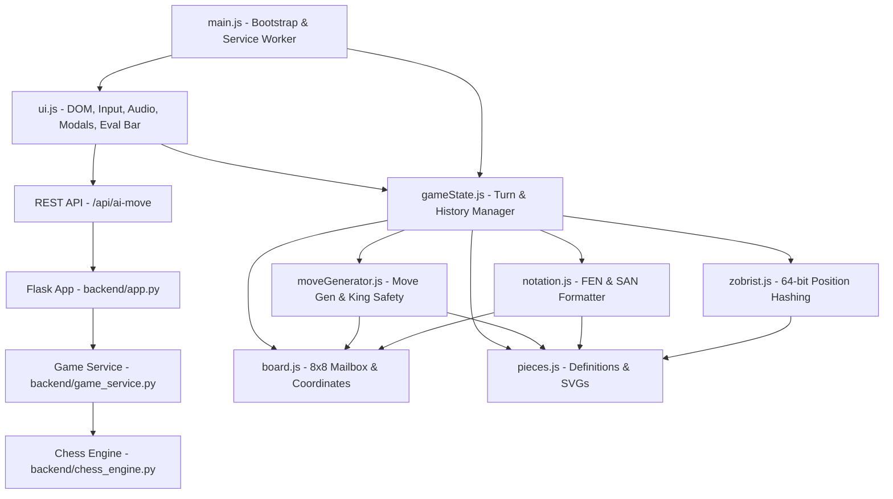

# System Architecture & Technical Design

This document details the architectural principles, component interactions, algorithmic choices, and state lifecycles within the Grandmaster Chess PWA codebase.

---

## 1. Architectural Philosophy

The application follows four fundamental tenets:
1. **Hybrid Client-Server Engine Decoupling**: The game operates as a unified Python-powered web application on port `5173`. When connected to the Python backend, the client utilizes an industrial-grade engine backed by `python-chess` with Negamax search, Alpha-Beta pruning, Piece-Square Tables (PST), and Quiescence search. If offline, the client seamlessly falls back to an embedded vanilla JavaScript engine with zero disruption.
2. **Zero Framework Overhead**: No React, Vue, or build-step bundlers. Using native ES modules allows instantaneous page loads, zero compilation delay during development, and trivial static file hosting.
3. **App-Conversion Ready**: The presentation layer avoids legacy browser assumptions (e.g. `window.open`, browser history API hacks, or fixed desktop pixel heights), enabling direct wrapping into Capacitor, Cordova, or Tauri with zero modifications.
4. **iOS 27 Liquid Glass Aesthetic**: A state-of-the-art visual design language utilizing heavy backdrop refractions, dynamic ambient light orbs, specular crystal bezels, and 100% scalable vector SVGs without any emojis.

---

## 2. Component Dependency Graph



---

## 3. Core Engine Modules

### `board.js` — Board Representation & Coordinates
- **Data Structure**: A 1-dimensional array of 64 elements (`0..63`).
- **Coordinate Translation**:
  - `square = rank * 8 + file`
  - `file = square % 8` (where `0` is file `a`, `7` is file `h`)
  - `rank = Math.floor(square / 8)` (where `0` is rank `1`, `7` is rank `8`)
- **Square Coloring**: `(file + rank) % 2 !== 0` designates a light square; otherwise dark.

### `moveGenerator.js` — Two-Tier Move Pipeline
Move generation uses a standard two-phase approach:

#### Phase 1: Pseudo-Legal Move Generation
Iterates across the 64 squares for pieces belonging to the active player:
- **Pawns**:
  - Single step forward: `sq + forwardDirection * 8` if destination is empty.
  - Double step forward: from initial rank (rank 1 for White, rank 6 for Black) if both intermediate and destination squares are empty.
  - Diagonal captures: `sq + forwardDirection * 8 ± 1` if occupied by enemy piece.
  - En Passant: captures diagonally to `enPassant` target square if set by the previous move.
  - Promotion: pawn moves reaching the opposite rank create 4 distinct legal options (`q`, `r`, `b`, `n`).
- **Knights & Kings**: Offset arrays applied within bounds checking.
- **Sliding Pieces (Bishops, Rooks, Queens)**: Ray-casting along direction vectors (`[-1, 1]`, `[0, 1]`, etc.) stopping upon hitting another piece or board boundary.

#### Phase 2: King Safety Verification (Legal Filtering)
To verify if a pseudo-legal move is legal:
1. Temporarily execute the move on the board array in-place.
2. If the move is castling, verify that the king was not in check, did not cross an attacked square, and does not land in check.
3. If the move is an en passant capture, remove the enemy pawn from the rank.
4. Locate the mover's king and evaluate `isSquareAttacked(board, kingSq, opponentColor)`.
5. Restore the modified squares on the board.
6. If the king was attacked, discard the move; otherwise, accept as legal.

*Why in-place array mutation?*
During recursive Perft node counting (evaluating hundreds of thousands of positions in seconds), cloning 64-element arrays generates high garbage-collector pause times. Mutating and immediately reverting in-place delivers sub-second execution speeds in pure JavaScript.

---

## 4. State Management Lifecycle (`gameState.js`)

Each turn transition follows a strict sequence:

```
[User Input: From -> To]
          │
          ▼
Validate against getLegalMoves()
          │
     ┌────┴────┐
   Valid     Invalid ──> Reject / Clear Selection
     │
     ▼
Create Snapshot for Undo History
     │
     ▼
Execute Move on Board Array
  - Update piece position
  - Handle castling rook movement
  - Handle en passant pawn deletion
  - Handle pawn promotion piece replacement
     │
     ▼
Update Castling Rights (king moved / rook moved / rook captured)
     │
     ▼
Update En Passant Square (pawn double push)
     │
     ▼
Update Halfmove Clock (reset on pawn move/capture, else increment)
     │
     ▼
Toggle Turn ('w' <-> 'b')
     │
     ▼
Compute 64-bit Zobrist Hash & Increment Repetition Count
     │
     ▼
Evaluate End Conditions:
  - Checkmate (in check AND 0 legal moves)
  - Stalemate (NOT in check AND 0 legal moves)
  - Threefold Repetition (same Zobrist key >= 3)
  - Fifty-Move Rule (halfmoveClock >= 100)
  - Insufficient Material
     │
     ▼
Generate SAN string and emit to UI
```

---

## 5. Audio Synthesis Engine (`ui.js`)

Rather than relying on external `.mp3` or `.wav` files (which may fail to download offline or produce latency), the app synthesizes all audio procedurally using the **Web Audio API**:

- **Move Sound**: Triangle oscillator swept from 320 Hz to 140 Hz over 90ms with exponential gain decay. Emulates the tactile "thud" of a wooden piece hitting a board.
- **Capture Sound**: Triangle wave at 480 Hz decaying to 80 Hz over 130ms at higher gain for crisp impact.
- **Check Alert**: Dual-tone chime (587.33 Hz / D5 transitioning to 880 Hz / A5).
- **Castling**: Staggered double-click sequence (90ms delay).
- **Game Over**: Harmonic A-major chord (440 Hz, 554.37 Hz, 659.25 Hz).

All sound calls are wrapped in an `enabled` check and respect mobile browser user-interaction policies (audio context initialization on first touch/click).

---

## 6. Chess AI Engine (`ai.js`)

The AI engine uses an optimized game-tree search pipeline tailored for client-side JavaScript:

1. **Negamax Search with Alpha-Beta Pruning**: Formulates minimax symmetrically using negamax where each node maximizes its relative advantage, reducing code branching and doubling search efficiency via alpha-beta cutoffs.
2. **Piece-Square Tables (PST)**: Utilizes curated positional matrices for Pawns, Knights, Bishops, Rooks, Queens, and Kings:
   - Central dominance (Knights/Pawns rewarded on `d4`, `e4`, `d5`, `e5`).
   - King safety in middlegame corners (`g1`/`b1`).
   - Active bishop diagonals and rook open files.
3. **Quiescence Search**: Solves the tactical "horizon effect" by recursively searching captures and promotions until the board reaches a non-volatile "quiet" position.
4. **Move Ordering (MVV-LVA)**: Sorts candidate moves prior to tree traversal, evaluating Most Valuable Victims taken by Least Valuable Attackers (e.g. `PxQ` evaluated before `QxP`), inducing rapid alpha-beta cutoffs.
5. **Difficulty Scaling**:
   - **Easy**: Blended random sampling with basic capture heuristics.
   - **Medium**: Depth 2 tree search with full positional evaluation.
   - **Hard**: Depth 3-4 tree search with alpha-beta pruning and tactical quiescence.

---

## 7. Victory Celebration & Particle Physics (`confetti.js`)

Upon checkmate or resignation, the UI triggers a multi-phase celebration:
1. **Dual-Cannon Fireworks**: Left and right angled particle cannons fire colorful ribbon and star projectiles with initial velocities, air drag (`0.985`), and gravity (`0.28`).
2. **Radial Starbursts**: Center-screen firework explosions emit sparkling geometric stars and circular particles.
3. **3D Flutter Simulation**: Ribbons oscillate along their vertical axis (`scaleY = Math.cos(wobble)`), simulating true 3D fluttering without WebGL overhead.
4. **Hardware Adaptation**: Canvas automatically scales with `window.devicePixelRatio` (capped at 2.0 for mobile thermal safety). Particle densities adapt dynamically (90 particles on mobile vs 160 on desktop).
5. **Harmonic Fanfare**: Procedural Web Audio brass fanfare arpeggio (`C4 -> E4 -> G4 -> C5`) supported by a sustained major third shimmer chord.
6. **Battery & Memory Safe**: Event loop terminates cleanly after the 4-second cascade or immediately upon dialog dismissal, releasing memory and frame requests.

---

## 8. Python Backend & Flask REST Engine (`backend/`)

The Python backend microservice powers the game's core calculations and provides an industrial-grade chess engine running on port `5173`:

- **Flask Microservice (`backend/app.py`)**:
  - Serves static assets (`index.html`, stylesheets, scripts, manifest, vector icons) and handles JSON API traffic.
  - Multi-threaded execution (`threaded=True`) ensures concurrent search tasks do not block static file delivery or UI responsiveness.
- **Python Chess AI Engine (`backend/chess_engine.py`)**:
  - Leverages standard `python-chess` for FIDE-compliant move generation and board state representations.
  - Combines Negamax search with Alpha-Beta pruning, MVV-LVA move ordering, and Quiescence search on tactical capture sequences.
  - Piece-Square Tables (PST) evaluate center control, piece activity, and king safety in real time.
- **Game Service (`backend/game_service.py`)**:
  - Handles FEN parsing, legal move generation, move application, in-check checks, termination rules, and PGN export formatting.
- **Detailed Endpoints**: Refer to [docs/API_REFERENCE.md](API_REFERENCE.md) for full endpoint specifications, request/response schemas, and example payloads.

---

## 9. Real-Time Position Evaluation Bar (`updateEvalBar`)

The interface includes a real-time live evaluation bar that dynamically visualizes the game balance:
1. **Centipawn Evaluation**: Calculates board advantage from White's perspective using piece values and positional tables.
2. **Sigmoid Win Probability Mapping**:
   $$\text{winProbability} = \frac{1}{1 + e^{-0.004 \times \text{score}}}$$
   - Maps raw centipawns to a clean percentage ($5\%$ to $95\%$).
   - Scores $> \pm 90,000$ (forced checkmate) pin the bar to $100\%$ or $0\%$ and display $+M$ / $-M$.
3. **Responsive Adaptation**:
   - **Desktop (>= 768px)**: Renders as a vertical liquid glass capsule running the full height of the chessboard with glowing numeric pill.
   - **Mobile (< 768px)**: Smoothly reflows into a sleek horizontal progress bar directly above the board to preserve 100% of the screen width for touch squares.

---

## 10. Multi-Scenario Outcome & Soundscape System

The game over system intelligently determines player roles and presents dedicated visuals and audio:

1. **Human vs AI — Defeat**:
   - Renders a somber dark obsidian modal (`.defeat-card`).
   - Rains falling crimson and charcoal ember particles (`startDefeat()`).
   - Displays a shattered knight sword combat emblem (`.defeat-svg-vector`).
   - Synthesizes a descending minor arpeggio chime (`G3 -> Eb3 -> C3 -> G2`).
2. **Human vs AI — Victory**:
   - Renders an emerald/gold victory card (`.victory-card`).
   - Explodes 60fps canvas fireworks and celebratory confetti ribbons (`startVictory()`).
   - Displays a sculpted luxury gold trophy vector SVG.
   - Plays a triumphant brass fanfare arpeggio (`C4 -> E4 -> G4 -> C5`).
3. **2-Player Local Mode**:
   - Explicitly displays the victor and defeated party with distinct color badges (e.g. *"White is Victorious! Black has been defeated"*).
4. **Draw & Stalemate**:
   - Displays a neutral slate card (`.draw-card`) with scales of justice and peaceful two-tone chime (`A3 -> D4`).

---

## 11. iOS 27 Liquid Glass Design System

The visual language follows the futuristic **iOS 27 Liquid Glass** design system:
- **Vitreous Refraction**: Surfaces use `backdrop-filter: blur(26px) saturate(210%)` over organic drifting liquid ambient lighting orbs.
- **Crystal Specular Sheens**: Borders and buttons feature multi-tier inner specular glares (`inset 0 1px 1px rgba(255, 255, 255, 0.45)`).
- **Apple Spring Micro-Animations**: Interactive buttons utilize Apple's signature spring curve `cubic-bezier(0.16, 1, 0.3, 1)` with press feedback and rotational icon animations.
- **Zero Emojis**: 100% vector SVG icons sculpted specifically for tournament aesthetics.
