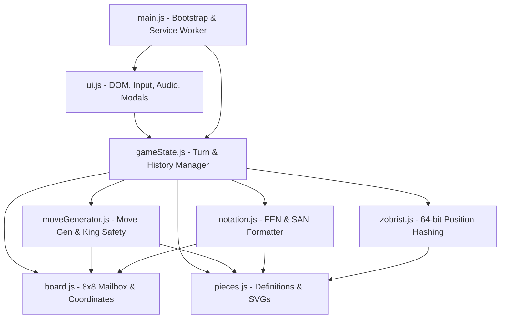

# System Architecture & Technical Design

This document details the architectural principles, component interactions, algorithmic choices, and state lifecycles within the Grandmaster Chess PWA codebase.

---

## 1. Architectural Philosophy

The application follows three fundamental tenets:
1. **Engine Independence**: The rules engine (`board.js`, `pieces.js`, `moveGenerator.js`, `zobrist.js`, `notation.js`, `gameState.js`) contains **zero dependencies on the DOM**, Web APIs, or window objects. It runs natively in Node.js for CLI testing, in Web Workers, or in any JS runtime.
2. **Zero Framework Overhead**: No React, Vue, or build-step bundlers. Using native ES modules allows instantaneous page loads, zero compilation delay during development, and trivial static file hosting.
3. **App-Conversion Ready**: The presentation layer avoids legacy browser assumptions (e.g. `window.open`, browser history API hacks, or fixed desktop pixel heights), enabling direct wrapping into Capacitor, Cordova, or Tauri with zero modifications.

---

## 2. Component Dependency Graph



---

## 3. Core Engine Modules

### `board.js` — Board Representation & Coordinates
- **Data Structure**: A 1-dimensional array of 64 elements (`0..63`).
- **Coordinate Translation**:
  - `square = rank * 8 + file`
  - `file = square % 8` (where `0` is file `a`, `7` is file `h`)
  - `rank = Math.floor(square / 8)` (where `0` is rank `1`, `7` is rank `8`)
- **Square Coloring**: `(file + rank) % 2 !== 0` designates a light square; otherwise dark.

### `moveGenerator.js` — Two-Tier Move Pipeline
Move generation uses a standard two-phase approach:

#### Phase 1: Pseudo-Legal Move Generation
Iterates across the 64 squares for pieces belonging to the active player:
- **Pawns**:
  - Single step forward: `sq + forwardDirection * 8` if destination is empty.
  - Double step forward: from initial rank (rank 1 for White, rank 6 for Black) if both intermediate and destination squares are empty.
  - Diagonal captures: `sq + forwardDirection * 8 ± 1` if occupied by enemy piece.
  - En Passant: captures diagonally to `enPassant` target square if set by the previous move.
  - Promotion: pawn moves reaching the opposite rank create 4 distinct legal options (`q`, `r`, `b`, `n`).
- **Knights & Kings**: Offset arrays applied within bounds checking.
- **Sliding Pieces (Bishops, Rooks, Queens)**: Ray-casting along direction vectors (`[-1, 1]`, `[0, 1]`, etc.) stopping upon hitting another piece or board boundary.

#### Phase 2: King Safety Verification (Legal Filtering)
To verify if a pseudo-legal move is legal:
1. Temporarily execute the move on the board array in-place.
2. If the move is castling, verify that the king was not in check, did not cross an attacked square, and does not land in check.
3. If the move is an en passant capture, remove the enemy pawn from the rank.
4. Locate the mover's king and evaluate `isSquareAttacked(board, kingSq, opponentColor)`.
5. Restore the modified squares on the board.
6. If the king was attacked, discard the move; otherwise, accept as legal.

*Why in-place array mutation?*
During recursive Perft node counting (evaluating hundreds of thousands of positions in seconds), cloning 64-element arrays generates high garbage-collector pause times. Mutating and immediately reverting in-place delivers sub-second execution speeds in pure JavaScript.

---

## 4. State Management Lifecycle (`gameState.js`)

Each turn transition follows a strict sequence:

```
[User Input: From -> To]
          │
          ▼
Validate against getLegalMoves()
          │
     ┌────┴────┐
   Valid     Invalid ──> Reject / Clear Selection
     │
     ▼
Create Snapshot for Undo History
     │
     ▼
Execute Move on Board Array
  - Update piece position
  - Handle castling rook movement
  - Handle en passant pawn deletion
  - Handle pawn promotion piece replacement
     │
     ▼
Update Castling Rights (king moved / rook moved / rook captured)
     │
     ▼
Update En Passant Square (pawn double push)
     │
     ▼
Update Halfmove Clock (reset on pawn move/capture, else increment)
     │
     ▼
Toggle Turn ('w' <-> 'b')
     │
     ▼
Compute 64-bit Zobrist Hash & Increment Repetition Count
     │
     ▼
Evaluate End Conditions:
  - Checkmate (in check AND 0 legal moves)
  - Stalemate (NOT in check AND 0 legal moves)
  - Threefold Repetition (same Zobrist key >= 3)
  - Fifty-Move Rule (halfmoveClock >= 100)
  - Insufficient Material
     │
     ▼
Generate SAN string and emit to UI
```

---

## 5. Audio Synthesis Engine (`ui.js`)

Rather than relying on external `.mp3` or `.wav` files (which may fail to download offline or produce latency), the app synthesizes all audio procedurally using the **Web Audio API**:

- **Move Sound**: Triangle oscillator swept from 320 Hz to 140 Hz over 90ms with exponential gain decay. Emulates the tactile "thud" of a wooden piece hitting a board.
- **Capture Sound**: Triangle wave at 480 Hz decaying to 80 Hz over 130ms at higher gain for crisp impact.
- **Check Alert**: Dual-tone chime (587.33 Hz / D5 transitioning to 880 Hz / A5).
- **Castling**: Staggered double-click sequence (90ms delay).
- **Game Over**: Harmonic A-major chord (440 Hz, 554.37 Hz, 659.25 Hz).

All sound calls are wrapped in an `enabled` check and respect mobile browser user-interaction policies (audio context initialization on first touch/click).
